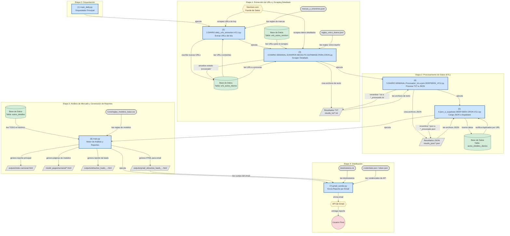

# Diagrama de Flujo de Datos del Proyecto

Este documento contiene un diagrama de flujo de datos detallado que describe todo el proceso, desde la ejecución del primer script hasta el envío final del correo electrónico.

El diagrama está escrito en sintaxis de **Mermaid**. Puede copiar y pegar el siguiente bloque de código en un visor en línea (como [mermaid.live](https://mermaid.live)) o usar una extensión en su editor de código para generar una imagen visual del flujo.

